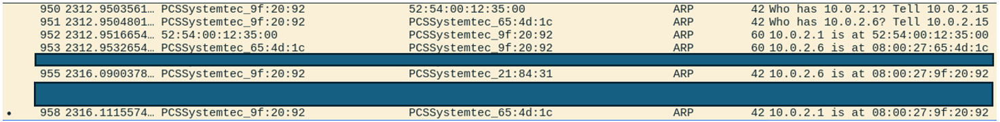
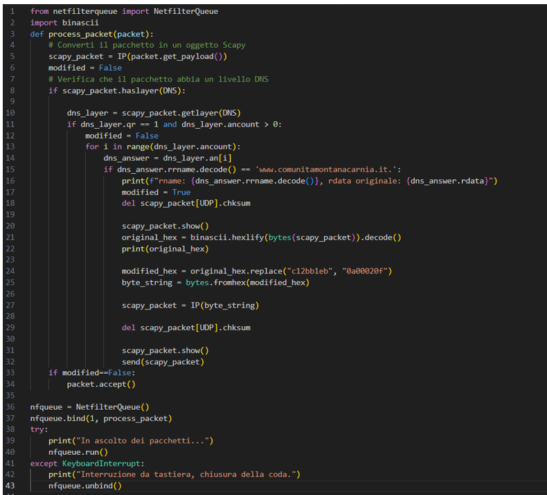
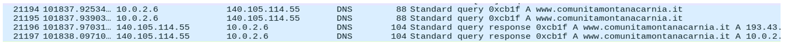
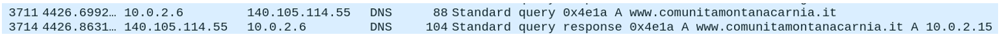
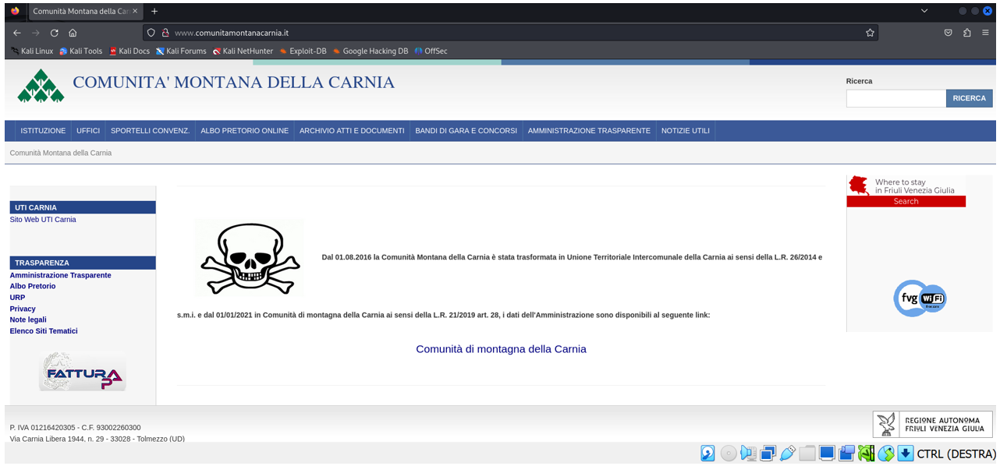
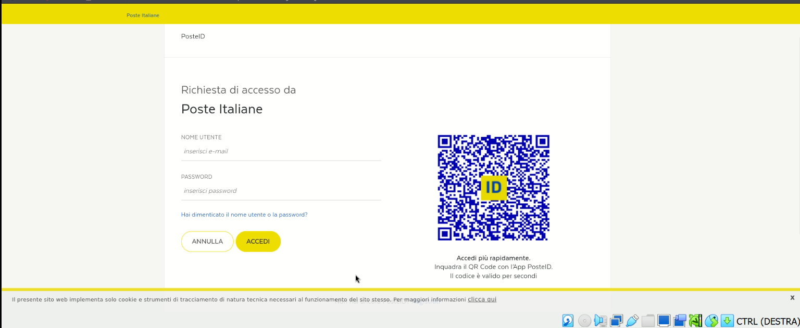

# Introduzione

Il mio progetto consiste nell’intercettare e modificare le risposte DNS per un determinato sito web: [http://www.comunitamontanacarnia.it](http://www.comunitamontanacarnia.it). L'obiettivo è far collegare il client a una copia del sito gestita da un web server controllato dall'attaccante. Nel mio caso, il web server è allocato nella macchina dell’attaccante. Questo attacco sfrutta la posizione dell'avversario che deve stare nella stessa rete della vittima utilizzando tecniche di ARP cache poisoning per diventare man-in-the-middle (MITM) e quindi poter modificare le risposte DNS.

# Threat Model

Il threat model preso in considerazione necessita che l’avversario sia sulla stessa rete della vittima e che possa utilizzare ARP cache poisoning per diventare MITM. Una volta ottenuto questo controllo, l'attaccante modifica le iptables per reindirizzare il traffico DNS in uscita dalla sua macchina verso uno script Python in grado di manipolare i pacchetti. Inoltre, l’attaccante deve essere in possesso di un web server in cui caricare la pagina falsa.

# Ambiente

Per eseguire questo attacco ho usato due macchine virtuali Kali Linux connesse alla stessa rete. Per farlo basta andare sulle impostazioni delle due macchine su rete, selezionare “connesso a: Rete con Nat” e anche “nome: NatNetwork”.

La configurazione nel mio caso specifico è:
- **Macchina dell’attaccante:** IP 10.0.2.15 MAC 08:00:27:9f:20:92
- **Macchina della vittima:** IP 10.0.2.6 MAC 08:00:27:65:4d:1c
- **Gateway:** IP 10.0.2.1 MAC 52:54:00:12:35:00

Per trovare l’indirizzo MAC dell’attaccante basta digitare da terminale `ip addr show eth0` mentre per trovare l’indirizzo IP si può usare `ifconfig`. Si può trovare l’indirizzo IP e MAC del gateway con il comando `ip neigh`.

# Svolgimento

## Indice
1. [Diventare MITM](#diventare-mitm)
2. [Deviare i pacchetti in uscita](#deviare-i-pacchetti-in-uscita)
3. [Modificare i pacchetti in uscita](#modificare-i-pacchetti-in-uscita)
4. [Prova della modifica dei pacchetti](#prova-della-modifica-dei-pacchetti)
5. [Preparazione web server](#preparazione-web-server)

## Diventare MITM

Dalla macchina dell’attaccante ho aperto ettercap (inserendo la password della macchina in quanto deve essere lanciato con sudo). Ho accettato la configurazione con la spunta in alto a destra. Ho avviato una scansione della rete per trovare gli host (lente di ingrandimento in alto a sinistra). Una volta finita la scansione posso visualizzare la lista degli host (il tasto a destra della lente di ingrandimento). Seleziono la macchina da attaccare e la aggiungo alla lista Target (schiaccio Add to Target 1). Ora avvio l’attacco ARP poisoning (vado sul pulsante in alto a destra simile a un planisfero e poi seleziono ARP poisoning quindi schiaccio ok).

ARP Poisoning sfrutta la natura non autenticata delle risposte ARP. L'attaccante invia pacchetti ARP falsificati sulla rete locale. In particolare viene inviato al gateway un pacchetto ARP che dice che l’indirizzo IP della vittima corrisponde all’indirizzo MAC dell’attaccante. Mentre alla vittima viene inviato un pacchetto ARP affermante che l’indirizzo del gateway corrisponde all’indirizzo MAC dell’attaccante. Il gateway e la vittima aggiornano la loro cache ARP. Ora, quando la vittima vuole inviare un pacchetto al gateway, in verità lo invierà all’attaccante. Quando il gateway vorrà inviare un pacchetto alla vittima, lo invierà all’attaccante. Se l’attaccante non modifica nulla, i pacchetti poi proseguiranno verso l’IP di destinazione corretto in quanto lui conosce il vero indirizzo MAC sia del gateway che della vittima. I pacchetti ARP per deviare la connessione attraverso l’attaccante devono essere poi reinviati periodicamente al fine di mantenere la connessione.

## Deviare i pacchetti in uscita

Adesso che sono diventato MITM, voglio modificare la risposta DNS del sito quindi modificare i pacchetti in uscita dalla macchina dell’attaccante che abbiano come source port 53 usata nel protocollo UDP per le comunicazioni DNS. Per farlo aggiungo una regola a iptables: `sudo iptables -I OUTPUT -p udp --sport 53 -j NFQUEUE --queue-num 1` questa regola permette di inviare i pacchetti in questione a una coda netfilter dove possono essere poi elaborati.

## Modificare i pacchetti in uscita

Con l’uso di un codice Python modifico i pacchetti che hanno come `rrname='www.comunitamontanacarnia.it.'` mettendo al posto dell’indirizzo IP del web server di 'www.comunitamontanacarnia.it’ l’indirizzo IP del web server in cui è allocata la copia della pagina web (in questo caso IP macchina attaccante). A causa di alcuni problemi nell’effettuare questa modifica, ho preferito usare il formato esadecimale per eseguirla (riga 24 dell’immagine sottostante) andando a sostituire l’indirizzo in questione (da `c12bb1eb` a `0a00020f`= 10.0.2.15). Infine, nelle ultime righe dello script vengono inviati regolarmente tutti i pacchetti DNS non modificati mentre se vengono modificati viene inviato il pacchetto modificato. Per avviare il codice si usa il comando `sudo python “nome del file”` (nel mio caso `sudo python print_packet2.py`).

## Prova della modifica dei pacchetti

Ora, quando la vittima prova a connettersi a [http://www.comunitamontanacarnia.it](http://www.comunitamontanacarnia.it), invierà una richiesta DNS verso il gateway. Questa passerà attraverso l’attaccante. Poi il gateway invierà la risposta alla vittima ma questa passerà attraverso l’attaccante che la modificherà mettendo l’indirizzo IP del suo web server. Quindi la vittima vedrà come risposta `www.comunitamontanacarnia.it A 10.0.2.15`.

## Preparazione web server

Per avere una copia dalla pagina web `www.comunitamontanacarnia.it` l’ho scaricata usando il software HTTrack. Sono stati necessari pochi passaggi tra cui incollare il link della pagina da scaricare. Dopo aver eliminato l’index già presente nella cartella `/var/www/html` della macchina attaccante, ho quindi inserito la pagina scaricata. Per renderla distinguibile dall’originale ho aggiunto un’immagine esplicativa. Per avviare il web server dalla macchina dell’attaccante, usando il terminale, ho digitato `/var/www/html` e poi `sudo service apache2 start` questo avvia un web server. Digitando l’URL del web server (nel mio caso 10.0.2.15) apparirà la pagina web inserita nella cartella `/var/www/html`.

Ora, se la vittima cercherà di collegarsi a `www.comunitamontanacarnia.it` invierà una richiesta DNS per questa pagina. La risposta che le arriverà conterrà l’indirizzo IP del web server dell’attaccante. Quindi lei si collegherà e le comparirà la pagina controllata dall’attaccante. L’immagine sottostante riporta come si presenta alla vittima la pagina. L’immagine al centro della pagina è stata aggiunta al fine di renderle distinguibili.

Poiché la pagina è sotto il controllo dell’attaccante, ho modificato il link associato alla scritta “Comunità di montagna della Carna” in modo che si colleghi a una copia della pagina [https://www.carnia.comunitafvg.it/](https://www.carnia.comunitafvg.it/). Anche questa è stata scaricata e caricata nel web server dell’attaccante. Inoltre, ho modificato anche il link alla pagina “accedi all’area personale” in alto a destra. Il sito web iniziale prevedeva vari metodi di autenticazione ma per semplicità ho selezionato solo quello con posteid. Quindi, quando la vittima schiaccerà su “accedi all’area personale” comparirà una copia della pagina di accesso con posteid. Affinché l’accesso vada a buon fine, è necessario che l’attaccante riesca a copiare velocemente il QRcode della pagina di accesso posteid e inserirla velocemente nella cartella `/var/www/html`. Infine, se anche la vittima scannerizzerà il QRcode in tempo permetterà l’autenticazione alla pagina da parte dell’attaccante. Inoltre, se la vittima inserirà le credenziali nella copia della pagina web, queste saranno visibili all’attaccante.

# Conclusioni

Alla vittima la pagina compare indistinguibile dall’originale. Di per sé, questo attacco può sembrare non essere molto utile in quanto non si ottengono né password né informazioni. Si può notare che cercando di fare il login si viene indirizzati verso un’altra pagina con connessione https. Scaricando anche questa pagina e cambiando la referenziazione dalla pagina html principale in modo che non vada a collegarsi alla pagina https bensì alla copia presente nel nostro web server possiamo facilmente rubare le credenziali.

## Credential access -> adversary-in-the-middle -> ARP cache poisoning
